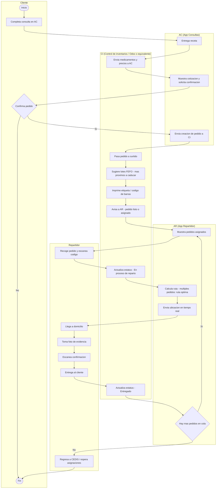

# Alcance del proyecto: Integración AC + CI + AR (Medicamentos y reparto)

## 1) Objetivo

Implementar el flujo “cotización → pedido → surtido → asignación a reparto → entrega” para medicamentos derivados de una consulta en **AC (App Consultas)**, operando inventarios y pedidos en **CI (Control de inventarios)** y ejecutando reparto mediante **AR (App Repartidor Android)**.

Notas:
- **AC ya existe y no entra dentro del alcance** de desarrollo de este proyecto; únicamente se considera su integración con CI mediante APIs.
- **CI puede ser un sistema existente** (por ejemplo, **Odoo**) configurado y extendido para cubrir los requerimientos, o bien un sistema propio. El alcance aquí descrito aplica a ambos escenarios (configuración + desarrollos necesarios).
- El alcance descrito aqui contempla todo el flujo de operación y la iteraccion entre los sistemas involucrados, sin embargo **el proveedor puede sentirse libre de cotizar, solo los sistemas que él puede proveer y no necesariamente todo el flujo de operación.**

## 2) Actores y sistemas

- **Cliente:** Usuario que realiza una consulta médica en AC y recibe una receta.
- **Repartidor:** Usuario que realiza el reparto con AR (Android).
- **AC (App Consultas):** Consume cotización, solicita confirmación y crea pedido en CI.
- **CI (Control de inventarios):** Administra inventarios/pedidos, lotes/caducidades, surtido, etiqueta/rastreo, estados y APIs.
- **AR (App Repartidor):** Recibe pedidos asignados, navegación/ruta, tracking, escaneo y evidencia de entrega.

## 3) Flujo operativo (descripción)

1. El **Cliente** completa su consulta médica en **AC** y recibe su receta.
2. **CI** envía a **AC** el listado de medicamentos disponibles con su precio (cotización).
3. **AC** muestra la cotización al cliente y solicita confirmación para generar el pedido.
4. El **Cliente** acepta la cotización.
5. **AC** envía la **creación del pedido** hacia **CI**.
6. En **CI**, el responsable de pedidos manda a **surtir** el pedido:
   - CI debe manejar **lotes/caducidades** y sugerir el surtido con regla **FEFO** (primero lo más próximo a caducar).
7. **CI** imprime una **etiqueta/código de barras** para identificar y rastrear el pedido.
8. Cuando el pedido está surtido y listo, **CI** genera la señal/evento hacia **AR** para su asignación/visibilidad en la cola de reparto.
9. El **Repartidor** recoge el pedido y **escanea** el código para validar que sea el pedido correcto.
10. **CI** actualiza el estatus del pedido a **“En proceso de reparto”**.
11. El **Repartidor** inicia el reparto; **AR** muestra la ruta desde la ubicación del repartidor hasta el destino.
12. Al llegar al domicilio del cliente, el repartidor:
   - Toma **foto de evidencia**.
   - Escanea nuevamente el código del pedido para confirmar que sea el correcto.
13. Al entregar el pedido al cliente, **CI** actualiza el estatus a **“Entregado”**.
14. Si el repartidor tiene más pedidos en cola, **AR** lo direcciona al siguiente pedido y se repite el proceso.
15. Si ya no existen pedidos en cola, el repartidor regresa al **CEDIS** para esperar nuevas asignaciones.

## 4) Diagrama de flujo (Mermaid)

## 5) Alcance funcional por sistema

### 5.1) AC (App Consultas)

Fuera de alcance:
- Desarrollo de la consulta médica, receta, UI/UX de AC, o cambios internos no asociados a integración.

Dentro de alcance (integración):
- Consumo de APIs expuestas por CI para:
  - Consultar medicamentos/precios (cotización).
  - Crear pedido.
  - Consultar estatus del pedido (si se requiere seguimiento al cliente).

### 5.2) CI (Control de inventarios) — Odoo o equivalente

Funcionalidad requerida:
- Gestión de inventarios con **lotes** y **caducidades**.
- Sugerencia de surtido con regla **FEFO**.
- Gestión de pedidos (creación, surtido, asignación, despacho y entrega).
- **Impresión de etiqueta/código de barras** para identificación y rastreo de pedido.
- Exposición de **APIs** para sistemas externos (AC y AR).
- Administración de **estados** del pedido durante reparto.

Consideración CI como sistema existente (ej. Odoo):
- Configuración y/o desarrollo de módulos para inventario por lote/caducidad, flujo de picking/packing y trazabilidad.
- Desarrollo de integraciones (APIs) y eventos/notificaciones hacia AR.
- Parametrización de estados, roles, permisos y operación en CEDIS.

### 5.3) AR (App Repartidor Android)

Funcionalidad requerida:
- Recepción de notificaciones tipo **PUSH**.
- Mostrar listado de pedidos asignados y pendientes.
- Trazado de ruta desde la ubicación del repartidor al destino; si hay múltiples pedidos, cálculo de **ruta óptima**.
- Envío de **ubicación** de manera continua o por intervalos para visualización en tiempo real.
- Escaneo de código de barras:
  - Al recolectar el pedido.
  - Al confirmar en domicilio antes de entregar.
- Captura de **foto** como evidencia de entrega.
- Comunicación Cliente ↔ Repartidor (chat y/o llamada).

## 6) Estados del pedido (mínimos)

- **En cola de reparto**
- **En proceso de reparto**
- **Entregado**

## 7) Endpoints / Integraciones (referencia)

Lista de integraciones mínimas esperadas (la especificación final se define en fase de análisis):
- **Búsqueda/cotización de medicamentos (CI → AC):** regresa nombre, presentación, precio, disponibilidad.
- **Creación de pedido (AC → CI):** crea el pedido con los medicamentos confirmados.
- **Aviso de pedido a AR (CI → AR):** evento/notificación para pedidos listos o asignados.
- **Actualización de estatus (AR → CI):** en cola de reparto, en proceso de reparto, entregado.
- **Tracking (AR → CI):** envío de ubicación (si se requiere concentrar en CI o en un servicio de tracking).
- **Evidencia (AR → CI):** carga de foto y metadatos de entrega (si se centraliza en CI).

## 8) Supuestos y exclusiones (para alinear expectativas)

Supuestos:
- Existe conectividad en CEDIS y en rutas de reparto para operación de AR y envío de ubicación.
- AC consumirá las APIs definidas por CI (o se proveerá una capa intermedia si aplica).

Exclusiones:
- Cambios funcionales internos de AC no relacionados a integración.
- Definición de políticas operativas (por ejemplo, qué se fotografía exactamente, retención de evidencias, SLA de entrega), salvo que se solicite.

## 9) Plazo de referencia

- Tiempo estimado objetivo: **3 meses**, sujeto al alcance final, selección de CI (Odoo vs propio), integraciones, pruebas y despliegues.
